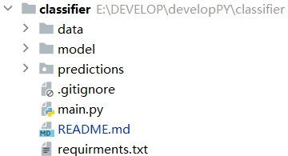
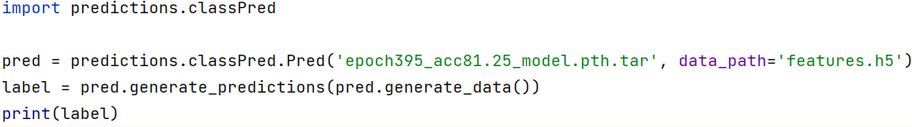
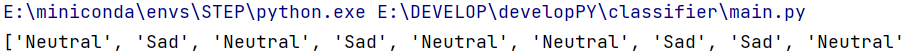

# pose_emotion_classifier


## 1基本构成



* 步态数据存储data：存放h5格式的步态数据，数据集形式为二维矩阵。
* 模型存储model：存放训练好的不同模型，可以根据需要选用。
* 情感预测包predictions：主要的推理模块，包含一个情感预测类。
* 测试脚本main.py：使用方法举例

------

## 2使用介绍

> 首先导入预测模块predictions中的classPred类

```python
import predictions.classPred
```

> 构造classPred对象，形参填入模型路径和步态数据路径

```python
pred = classPred.Pred('epoch395_acc81.25_model.pth.tar', 'features.h5')
```

> 使用类成员方法generate_data生成加工后的数据

```python
data = pred.generate_data()
```
>
> 调用类成员方法generate_predictions，形参填入加工过后的数据

```python
label = pred.generate_predictions(data)
```

> 获取情感

```
print(label)
```

----

## 3测试运行




