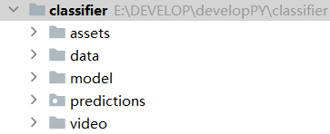
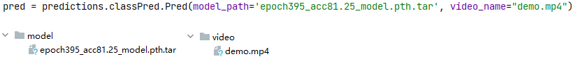
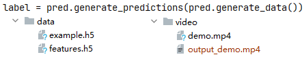
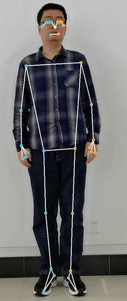
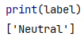
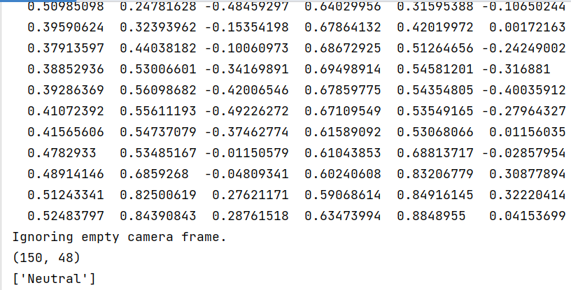

# pose_emotion_classifier


## 1基本构成



* 步态数据存储data：存放h5格式的步态数据，数据集形式为二维矩阵。
* 视频存储路径video：存放需要进行预测的数据。
* 模型存储model：存放训练好的不同模型，可以根据需要选用。
* 情感预测包predictions：主要的推理模块，包含一个情感预测类。
* 测试脚本main.py：使用方法举例。

------

## 2运行流程

==1. 从指定目录读取模型（model）和原始步态视频（video）==

  

  

==2.  进行生成步态数据到指定目录（data）和加工后的步态视频（video/output_<video_name>）==


    


3. 生成对应情感标签

    

## 3使用介绍

> 首先导入预测模块predictions中的classPred类

```python
import predictions.classPred
```

> 构造classPred对象，形参填入模型路径和视频路径

```python
pred = classPred.Pred('epoch395_acc81.25_model.pth.tar', 'demo.mp4')
```

> 使用类成员方法generate_data生成加工后的数据

```python
data = pred.generate_data()
```
>
> 调用类成员方法generate_predictions，形参填入加工过后的数据

```python
label = pred.generate_predictions(data)
```

> 获取情感

```python
print(label)
```

----

## 4测试运行

**==运行示例==**




